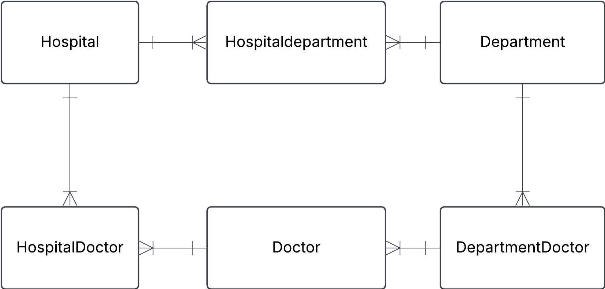
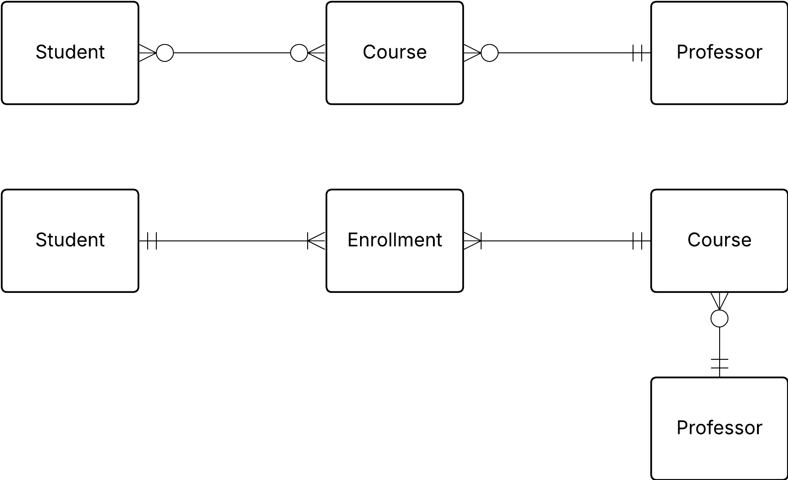

<!-- # 1. Convert json-file to tables
''' You have this json data, convert it into three tables: Hospital, Department and Doctor. Fill these tables with data. Do this manually and not programmatically.

{
  "hospital": "Sjukhusstock",
  "address": "Drottninggatan 3, Stockholm",
  "departments": [
    {
      "name": "Kardiologi",
      "doctors": [
        { "id": 1, "name": "Dr. Abra Abrahamson" },
        { "id": 2, "name": "Dr. Erika Eriksson" }
      ]
    },
    {
      "name": "Neurologi",
      "doctors": [{ "id": 3, "name": "Dr. Sven Svensson" }]
    }
  ]
} -->

### Solution

<!-- - identify entities
- identify relationships### --> -->

**Initial naive conceptual ERD**

**Initial tables**

Hospital

| Hospital_id | name         | address          |
| ----------- | ------------ | ---------------- |
| 1           | Sjukhusstock | Drottninggatan 3 |

Department

| department_id | name       |
| ------------- | ---------- |
| 1             | Kardiologi |
| 2             | Neurologi  |

Doctor

| Doctor_id | name             | department_id |
| --------- | ---------------- | ------------- |
| 1         | Abra Abrahamsson | Kardiologi    |
| 2         | Erika Eriksson   | Kardiologi    |
| 3         | Sven Svensson    | Neurologi     |

Refined with bridge tables to reflect many-to-many relationships

#Exercise 0

## 1. Hospital task

### Solution

Hospital Department

| Hospital_department_id | hospital_id | department_id |
| ---------------------- | ----------- | ------------- |
| 1                      | 1           | 1             |
| 2                      | 1           | 2             |

HospitalDoctor

| hospital_doctor_id | hospital_id | doctor_id |
| ------------------ | ----------- | --------- |
| 1                  | 1           | 1         |
| 2                  | 1           | 2         |
| 3                  | 1           | 3         |

TODO: Left for the reader

DepartmentDoctor

TODO: left for the reader

Test a join

Want information on sjukhusstock and inte departments

- hospital_department can join with department_id on deparment table
  and hospital_id on hospital table
- query name from hospital table name from department table

TODO: left for reader: create this sql query

SELECT h.name AS hospital_name, d.name AS department_name
FROM Hospital h
JOIN hospital_department hd ON h.hospital_id = hd.hospital_id
JOIN Department d ON hd.department_id = d.department_id
WHERE h.name = 'Sjukhusstock';

## 2 Library Bookly

a.

## Book

| ISBN | title | author |
| ---- | ----- | ------ |

# Note ! 
ISBN is a unique number for each book, which could be used as a Primary Key, this will make it into a natural key.
## Member

| membership_id | name | phone | address | email |
| ------------- | ---- | ----- | ------- | ----- |

## Borrowing

| borrow_id | borrow_date | return_date | ISBN | membership_id |
| --------- | ----------- | ----------- | ---- | ------------- |

b.

- A member can have zero, one or several Borrowings
- A Borrowing can be made my one and only one member
- A Borrowing is linked to and and only one Book
- A A book can be in zero, one or more Borrowings

c.

## Initial conceptual ERD

 

## Replaced many to many with a bridge table (composite entity)

 

# 3 conceptual ERD to words
This is an ERD conceptual diagram that a database designer and the business stakeholders agreed upon in a car rental company called Carent.

  

a) Describe the entities in this conceptual ERD.

b) Write out the relationship labels.

c) Describe the relationships between the entities (one-to-many, one-to-one and many-to-many).

d) Define the relationship statement for example: "A Customer can have one or more Rentals".

a
- Customer is a person that can rent cars.
- Car is a vehicle than can be rented by a Customer.
- Rental (composite entity) is a transaction between Customer and Car

b) see image above

c)
- Customer to rental (one to many)
- Rental to customer (Many to one)
- Rental to car (Many to one)
- Car to rental (One to many

d)
- Each Customer makes on or more Rentals over time
- Each Rental is connected to one Customer
- Each Rental is for one Car
- Each 

## 5. University management system

A university needs a system to manage students, courses, and professors.

- each student can enroll in multiple courses.
- each course is taught by one professor.
- a teacher can teach multiple courses.

a) Identify entities and their relationships

b) Come up with possible attributes for the entities

c) Draw conceptual ERD with cardinalities

d) Define business rules (e.g. a student can enroll in max 4 courses)

a) 
Students, courses, professors, enrollment

b) See attributes below:
