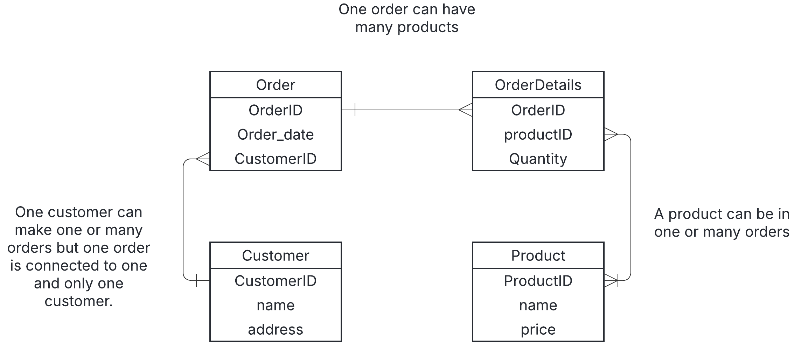

# 0
a) 
### 1NF
- The table satisfies NF1 because there are no repeating groups or lists in a cell.
- All rows must be unique and identified with a PRIMARY KEY.
### 2NF
- The table has to be in NF1.
- All non prime attributes must fully depend on the whole PRIMARY KEY, not just a part of it.
- The table has a composite PRIMARY KEY (order_id,product_id)-
order_date,customer_id,customer_name,customer_address depends only on order_id(not product_id), which violates 2NF.

b)

c) 
- Adding price to the Orderdetails table is the best option. If a product is priced at 100 SEK i January and changed to 120 SEK in February, then it would be hard to know exactly what the customer payed for the product if the price would be in the Products table. 
- This could be confusing when reporting or if you need to track earnings based on the actual price at purchase.

d)
SELECT 
    od.OrderID,
    c.CustomerID,
    c.Name AS CustomerName,
    p.ProductName,
    od.Quantity,
    od.Price AS ProductPrice,
    (od.Quantity * od.Price) AS TotalPrice
FROM 
    OrderDetails od
JOIN 
    Customers c ON od.CustomerID = c.CustomerID
JOIN 
    Products p ON od.ProductID = p.ProductID
WHERE 
    c.Name = 'Ragnar Lodbrok';

Output: 
| OrderID | CustomerID | CustomerName   | ProductName  | Quantity | ProductPrice | TotalPrice |
|---------|------------|----------------|--------------|----------|--------------|------------|
| 101     | 05         | Ragnar Lodbrok | Blåbärsmagi  | 20       | 10.00        | 200.00     |
| 101     | 05         | Ragnar Lodbrok | Lakritsdröm  | 15       | 15.00        | 225.00     |
| 101     | 05         | Ragnar Lodbrok | Lichipichi   | 35       | 20.00        | 700.00     |

